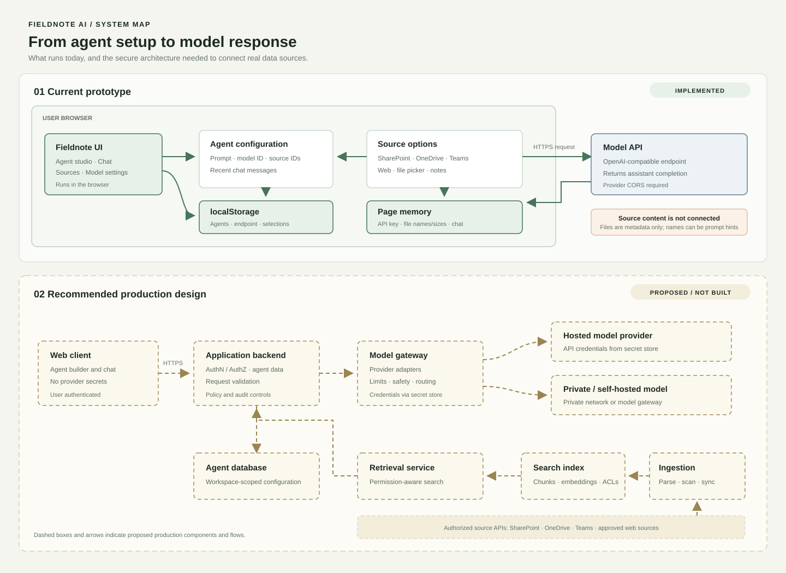
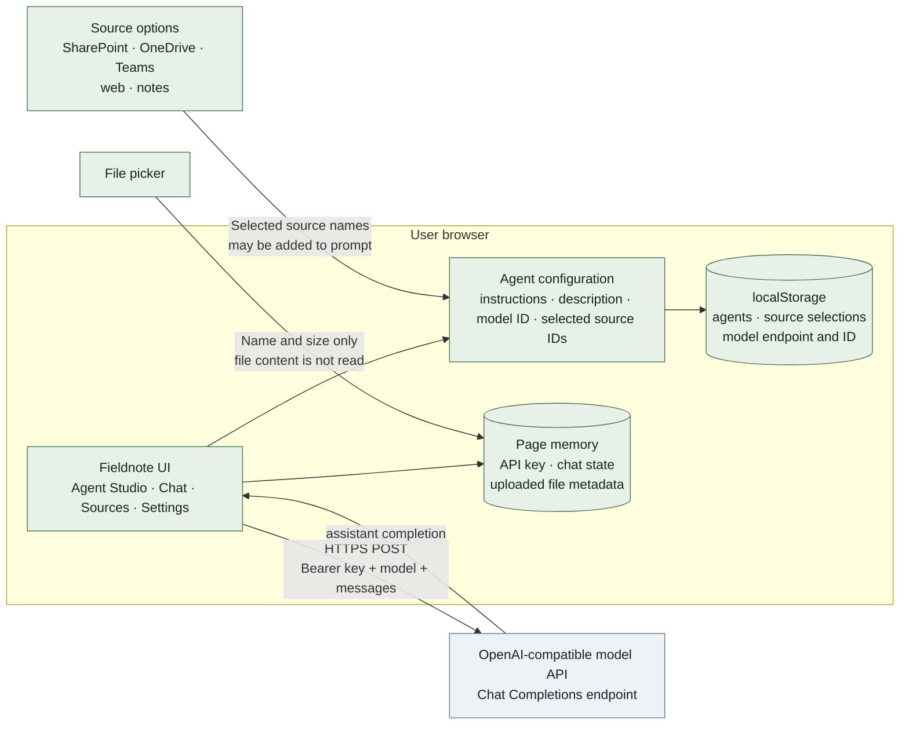
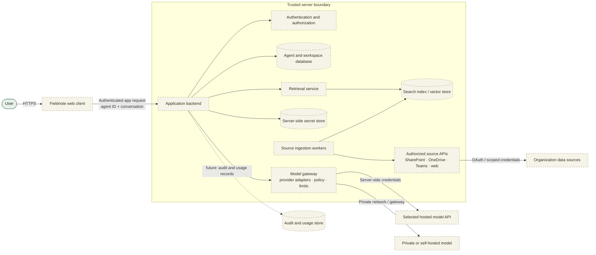

# Fieldnote AI Architecture

This document shows the current browser-only prototype and a separate recommended production design. Solid arrows describe behavior that exists in `index.html`; dashed arrows and dashed boxes are proposed work, not implemented integrations.

## Current prototype

### Current request flow

1. Agent instructions, description, selected model, and selected source IDs are stored in browser `localStorage`.
2. The API key exists only in page memory. It is not written to local storage and is lost when the page is refreshed.
3. Chat sends the system instructions, recent messages, model ID, temperature, and token limit directly from the browser to the configured endpoint.
4. If enabled, selected source names are included as hints. No source content is fetched or retrieved.
5. Uploaded files are represented by their names and sizes only. The prototype does not read or index file contents.

The browser-to-provider connection depends on the provider allowing requests from the page's origin. A browser key is exposed to the user of the page, so this direct-call design is for local evaluation only, not production.

## Recommended production architecture

### Production request flow

1. The user authenticates to the application; the backend checks workspace and agent permissions.
2. The backend loads the agent configuration and retrieves relevant authorized content from the search index.
3. A model gateway chooses the configured provider adapter and applies policy, rate limits, and token limits.
4. Provider credentials are read on the server from a secret store. They are never sent to the browser.
5. The model response returns through the backend to the client. Usage and security events can be audited.
6. Source connectors ingest content using scoped authorization and maintain the search index independently from chat requests.

## Prototype-to-production gaps

| Capability | Current prototype | Production requirement |
| --- | --- | --- |
| Model requests | Browser sends an OpenAI-compatible request directly | Authenticated backend and server-side model gateway |
| API credentials | Entered in the page; held in memory | Secret store, rotation, and access controls |
| Agent persistence | Browser local storage | Shared database with workspace authorization |
| Source connectors | Selectable UI placeholders | OAuth authorization, scoped ingestion, and revocation |
| File handling | Stores file name and size only | Validated upload, scanning, parsing, indexing, retention policy |
| Retrieval | Source names may be prompt hints | Permission-aware retrieval with citations and source boundaries |
| Operations | No server logs or account system | Monitoring, audit trail, abuse controls, and backup strategy |
